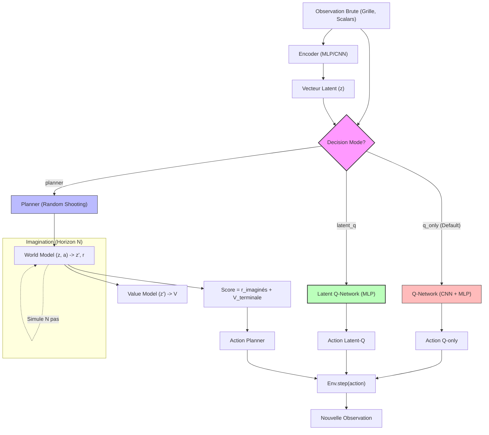

# SeedMind — Schémas d'Architecture et de Décision

Ce document regroupe les diagrammes décrivant le fonctionnement des différents modes de décision (dont le nouveau mode `latent-q`) et le pipeline d'entraînement parallèle sur le Replay Buffer.

---

## 1. Flux de Décision (Inférence de l'Agent)

Ce schéma décrit comment l'observation brute de l'environnement est traitée selon le mode de décision choisi (`q_only`, `latent_q` ou `planner`).



---

## 2. Flux d'Entraînement (Parallèle sur le Replay Buffer)

Ce schéma décrit comment l'agent met à jour ses différents réseaux en parallèle à partir des transitions réelles du Replay Buffer.

```mermaid
graph LR
    subgraph "Replay Buffer"
        Buffer[("Transition réelle: s, a, r, s', done, events")]
    end

    %% Entraînement de l'Encoder
    Buffer --> |"Projection"| Enc["Encoder"]
    
    %% Entraînement Q-only
    Buffer --> |"Loss TD (Observationnelle)"| QObs["Q-Network (s)"]
    
    %% Entraînement Latent-Q
    Buffer --> |"Loss TD (sur latents z, z')"| QLat["Latent Q-Network (z)"]
    Enc -.->|Fournit z, z'| QLat

    %% Entraînement World Model
    Buffer --> |"Loss Causal & Transitions"| WM["World Model (z, a) -> z', r, events"]
    Enc -.->|Fournit z, z'| WM

    %% Entraînement Value Model
    Buffer --> |"Loss Value (TD ou Monte Carlo)"| VM["Value Model (z)"]
    Enc -.->|Fournit z| VM
    
    %% Option Dyna (Futur)
    WM -.->|Rêves / Dyna (z_synthétique)| QLat

    style Buffer fill:#ddd,stroke:#333,stroke-width:2px
    style QLat fill:#bfb,stroke:#333,stroke-width:2px
    style WM fill:#bbf,stroke:#333,stroke-width:2px
    style VM fill:#bbf,stroke:#333,stroke-width:2px
```
